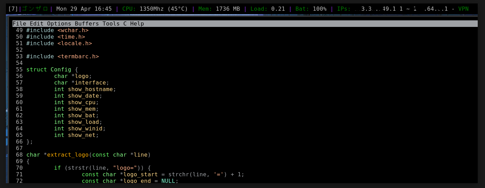

# Termbar in C

termbar(in C) is a status bar for cwm (or other wm) on OpenBSD (no idea if works on
linux or other OS and also I don't care).

The idea was to make my original [termbar](https://github.com/gonzalo-/termbar/) in C and
I took inspiration from [sdk's cbar](https://git.uugrn.org/sdk/cbar), it's hardly
modified but yet, helped me a lot.

CAVEATS: This is a testing and still developing version, I tested in a couple machines
so it might not work on yours or probably put on fire your laptop, so be careful and don't
complain much, if you have some feedback you know where you can find me.



## Features

termbar for now can show you, a "logo" (or name), hostname, cpu speed and temp,
free mem, window id, load average, battery status (probably only in thinkpads), public IP,
private IP and if you are connected to a VPN.

The battery percentage it will turn red if your machine is not connected to the AC as
the VPN output will be "No VPN" in red if there is no wg(4) present or tunnel up (still on
testing).

If your CPU has no sensors or not supported it will show an "x" next to the CPU speed, you
will probably see this on a VM or old machine (not very much tested).

## Usage

termbar has now a config file (which you should have in ~/.termbar.conf after the install),
you have an example [here](termbar.conf) with all the options available:

```
logo=termbar
date=yes
cpu=yes
bat=yes
mem=yes
load=yes
net=yes
winid=yes
hostname=yes
interface=iwm0
vpn=yes
```

The only 2 options you can play with are "logo" and "interface", "logo" will just print
something you put there and "interface" will be use to get the internal ip of your
machine.

With the other options are pretty straigforward, "yes" to show the information on termbar
and "no" to hide it.

## Display

For displaying termbar in your cwm or maybe another wm, you need to create a thin xterm that
will show the output, for this you can add a similar line in your .xsession:

```
...
# Termbar
exec xterm -fs 12 -bg "black" -fg "grey" -name termbar -class termbar -T termbar -e ~/bin/termbar &
...
exec cwm
```

For cwm I usually let a gap on the top of the screen for termbar with the follow on my .cwmrc:

```
...
gap						35 5 5 5
...
```

The full files for cwm and .xsession are [here.](https://github.com/gonzalo-/termbar/).

You probably can use termbar also in tmux as status bar, you might want to add or modify your
~/.tmux.conf to something like:

```
...
set -g status-right "#{exec ~/bin/termbar}"
...
```

## Dependencies

In the current state you just need curl to check your public ip.

```
$ doas pkg_add curl
```

## Build

You have all you need in your OpenBSD base installation, so by cloning the repo
and building is as easy as:

```
$ git clone https://github.com/gonzalo-/termbarc/
$ cd termbarc
$ make
rm -f termbar
cc -O0 -g -pipe -Wall -Werror -march=native -I. -o termbar  termbarc.c
```

## Installation

termbar will go to your ${HOME}/bin directory, if you want to put it somewhere
else you should modify the Makefile, otherwise make sure you have a ~/bin
directory and then:

```
$ make install
install -s termbar /home/gonzalo/bin/termbar
install termbar.conf /home/gonzalo/.termbar.conf
```

## Uninstall

If termbar it's not for you, you can uninstall it with:

```
$ make uninstall
rm -f /home/gonzalo/bin/termbar
rm -f /home/gonzalo/.termbar.conf
```
